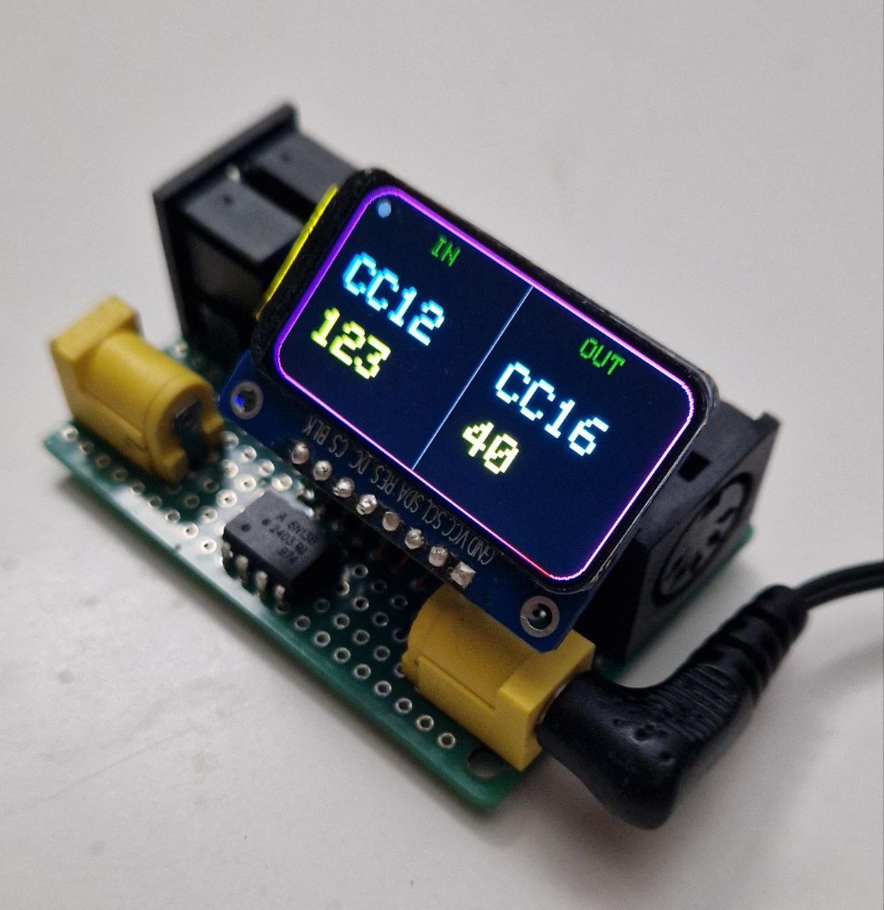

MIDI Mapper is a MIDI processor that allows you to transform and remap MIDI signals in a flexible and intuitive way.

  

Features:
* Intuitive WEB user interface
* LCD display showing the MIDI command flow in real time
* Ability to assign multiple output messages to a single input message

The project enables different music devices to understand and communicate with each other, even when their native MIDI implementations are incompatible. 
MIDI Mapper acts as a bridge between controllers, synthesizers, effects, and software, giving musicians and engineers full control over how MIDI data is interpreted and routed.
